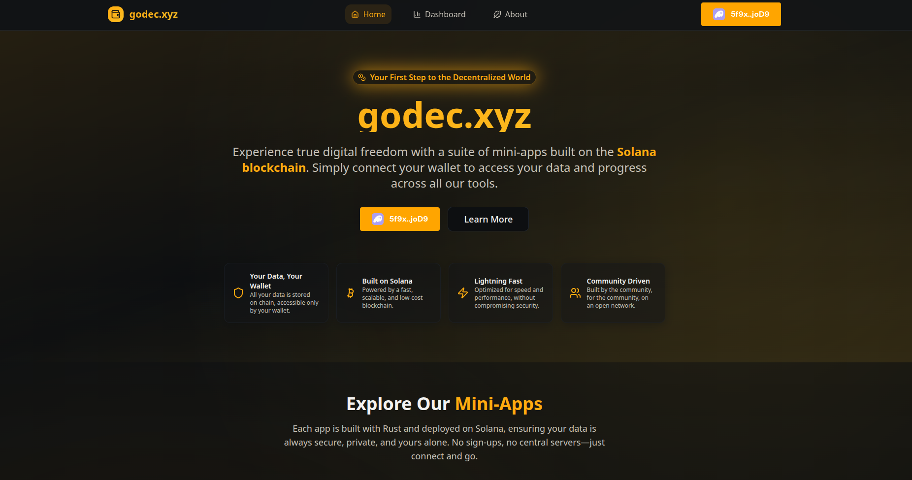
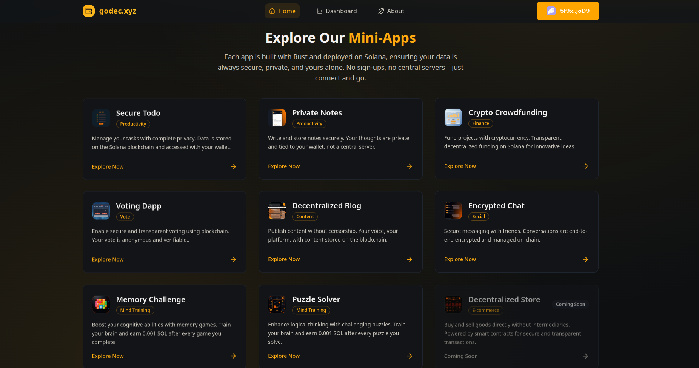
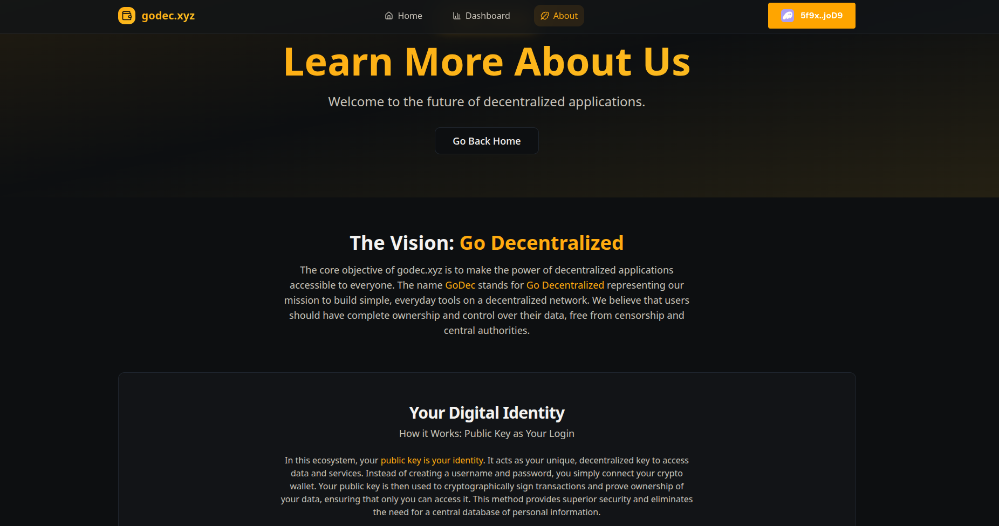

# godec.xyz

**Go Decentralized** with godec.xyz, a beginner-friendly platform to take your first steps into Web3 through simple, decentralized mini-apps built on the Solana blockchain.

## Problem Statement

Many users are unaware of Web3 or find decentralized applications (dApps) complex and intimidating, creating a barrier to adopting technologies that offer enhanced privacy, security, and user control. The lack of intuitive, beginner-friendly tools hinders Web3's mainstream adoption.

## Solution

godec.xyz (short for **Go Decentralized**) is designed as a baby step into Web3. It offers a suite of simple, daily-use mini-apps (e.g., Secure Todo, Private Notes, Decentralized Blog) on Solana, mimicking familiar Web2 tools. These apps allow users—especially Web3 newcomers—to experience decentralization by connecting a Solana wallet, managing on-chain data, and learning Web3 concepts like wallet integration and decentralization through practical use.

### Key Features
- **Simple Mini-Apps**: Everyday tools like task managers, blogs, and chats, powered by Solana’s fast, low-cost blockchain.
- **Wallet-Based Access**: Secure, no-signup access via Solana wallets (e.g., WalletMultiButton).
- **Privacy & Security**: On-chain data storage with robust token management (e.g., `refreshTokenUser` for secure token validation).
- **Educational Experience**: Learn Web3 through intuitive app interactions.
- **Community-Driven**: Open platform for collaborative growth.

## Available Mini-Apps

| Title                | Description                                                                 | Route                | Category         |
|----------------------|-----------------------------------------------------------------------------|----------------------|------------------|
| Secure Todo          | Manage tasks privately, stored on Solana, accessed via wallet.               | `/todo`              | Productivity     |
| Private Notes        | Securely write and store notes tied to your wallet, not a central server.    | `/notes`             | Productivity     |
| Crypto Crowdfunding  | Fund projects transparently with cryptocurrency on Solana.                   | `/crowdfunding`      | Finance          |
| Voting Dapp          | Secure, anonymous, and verifiable voting on the blockchain.                  | `/vote-app`          | Vote             |
| Decentralized Blog   | Publish censorship-free content stored on the blockchain.                    | `/blog`              | Content          |
| Encrypted Chat       | End-to-end encrypted messaging, managed on-chain.                            | `/chat`              | Social           |
| Memory Challenge     | Boost cognitive skills with memory games, earn 0.001 SOL per completion.     | `/game/memory-game`  | Mind Training    |
| Puzzle Solver        | Enhance logical thinking with puzzles, earn 0.001 SOL per puzzle solved.     | `/game/puzzle-game`  | Mind Training    |

## Screenshots





## Current Status

The dApp store is **coming soon**. The platform currently features the listed mini-apps, with more in development to ease users into Web3.

## Future Vision

godec.xyz will grow by:
- Adding more mini-apps (e.g., e-commerce, lotteries, games) based on user feedback.
- Including in-app Web3 tutorials for real-time learning.
- Expanding community-driven development for diverse use cases.
- Enhancing backend (e.g., token refresh) for scalability and security.

Our mission is to make Web3 accessible to everyone, guiding newcomers into decentralization one mini-app at a time.

## Technology Stack
- **Solana Blockchain**: High-throughput, low-cost foundation for scalable apps.
- **Rust**: Secure smart contracts deployed via Solana Playground.
- **TypeScript & Vite**: Robust, type-safe frontend built with TypeScript and Vite.
- **Decentralized Security**: On-chain data storage for privacy and control.

## Installation

### Backend
1. **Smart Contract Setup**:
   - Smart contracts are written in Rust and deployed via [Solana Playground](https://beta.solpg.io/).
  

### 🚀 Frontend Setup (Vite + React + TypeScript)

Follow the steps below to set up and run the frontend app.

---

#### 1. Clone the Repository

```bash
git clone https://github.com/everestp/godec_xyz.git
cd godec_xyz
